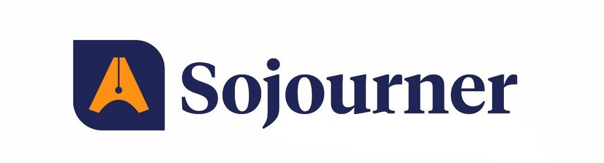

<html lang="en">
<head>
  <meta charset="UTF-8" />
  <meta name="viewport" content="width=device-width, initial-scale=1.0" />
  <title>Fifi's Drag Race Season 4 | Sojourner News</title>

  <!-- Fonts -->
  <link rel="preconnect" href="https://fonts.googleapis.com" />
  <link rel="preconnect" href="https://fonts.gstatic.com" crossorigin />
  <link href="https://fonts.googleapis.com/css2?family=Inter:wght@400;500;600&family=Merriweather:ital,wght@0,300;0,400;0,700;0,900;1,400&display=swap" rel="stylesheet" />

  <!-- FontAwesome for Icons -->
  <link rel="stylesheet" href="https://cdnjs.cloudflare.com/ajax/libs/font-awesome/6.4.0/css/all.min.css">

  
</head>
<body>

  <!-- Top Info Bar -->
  

    
    Manila, PH: 88°F
    Subscribe
    Login
  

  <!-- Header -->
  <header>
    

      
      

        <i class="fas fa-bars menu-toggle" onclick="toggleMenu()"></i>
        <button onclick="scrollToSubscribe()">Subscribe</button>
      

    

  </header>

  <!-- Navigation -->
  <nav>
    

      

        <a href="#" onclick="filterCategory('all')">Home</a>
        <a href="#">World</a>
        <a href="#">Entertainment</a>
        <a href="#">Culture</a>
        <a href="#">Politics</a>
        <a href="#">Tech</a>
        <a href="#">Sports</a>
      

    

  </nav>

  <!-- Main Content -->
  

    
    <!-- Article Header -->
    <header class="article-header">
      Entertainment & Culture
      <h1>Fifi's Drag Race Season 4: Celebration of Artistry, Inclusivity, and Fierce Self-Expression</h1>
      

        <i class="far fa-clock"></i> October 21, 2025 &nbsp;|&nbsp; 
        <i class="far fa-user"></i> By Princess Louise Gonzales
      

    </header>

    <!-- Hero Image -->
    

    <!-- Article Body -->
    <article class="article-content">
      
Fifi's Drag Race successfully concluded its fourth season, produced by the Broadcasting students from the Hostel of Bulacan State University. The event once again proved to be a vibrant platform for creativity, inclusivity, and empowerment—celebrating the artistry and individuality of every performer who graced the stage.

      
Extraordinary, colorful, and dazzling showcases filled the venue with confidence, glamour, and fierce performances. Each contestant brought their unique style and charisma, captivating the audience with stunning looks and exceptional talent. From extravagant costumes to powerful lip-sync numbers, every act embodied passion, creativity, and authenticity—the true essence of drag.

      <blockquote class="quote">
        "Hosted by Madam Fifi, the competition highlighted the importance of self-expression and freedom, giving performers the space to shine unapologetically."
      </blockquote>

      
Adding to the excitement, one of the previous season's standout candidates made a special appearance to show support and inspire the new batch of drag artists. The grand finale, held on Friday, October 10, transformed the venue into a dazzling stage of color, energy, and pride.

      
The event concluded with a grand awarding ceremony that honored the top performers who impressed the judges with their skill, creativity, and stage presence.

      
After weeks of preparation and breathtaking performances, <strong>VANILLAUXXE</strong> emerged as the new Fifi's Drag Race Season 4 Superstar, marking the end of yet another unforgettable season that celebrated not just drag but the power of being unapologetically yourself.

      
via Princess Louise Gonzales

      <!-- Share Buttons -->
      

        
<i class="fab fa-facebook-f"></i> Share

        
<i class="fab fa-twitter"></i> Tweet

        
<i class="fab fa-linkedin-in"></i> Share

      

    </article>

    <!-- Newsletter -->
    

      <h4>Subscribe to Sojourner News</h4>
      
Get the latest entertainment news and updates delivered to your inbox.

      <form onsubmit="handleSubscribe(event)">
        <input type="email" placeholder="Your email address" required />
        <button type="submit">Subscribe Now</button>
      </form>
    

  

  <!-- Footer -->
  <footer>
    

      

        <h4>SojournerNews</h4>
        

          Delivering global perspectives with integrity and depth.
        

      

      

        <h4>Sections</h4>
        <a href="#">World</a>
        <a href="#">Entertainment</a>
        <a href="#">Politics</a>
        <a href="#">Business</a>
      

      

        <h4>About</h4>
        <a href="#">Our Story</a>
        <a href="#">Careers</a>
        <a href="#">Contact</a>
      

      

        <h4>Follow Us</h4>
        <a href="#"><i class="fab fa-facebook"></i> Facebook</a>
        <a href="#"><i class="fab fa-twitter"></i> Twitter</a>
        <a href="#"><i class="fab fa-instagram"></i> Instagram</a>
      

    

    

      &copy; 2026 SojournerNews. All Rights Reserved.
    

  </footer>

  

</body>
</html>
